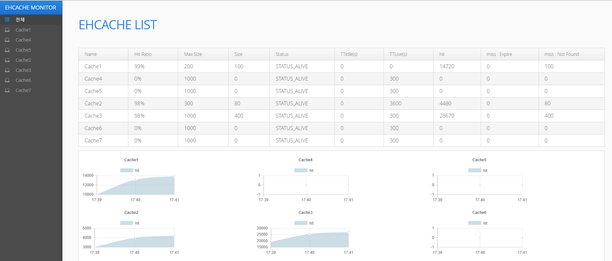
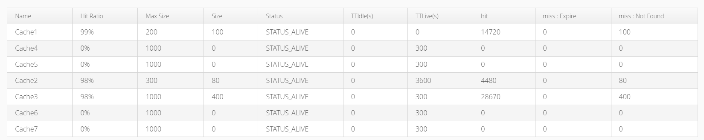
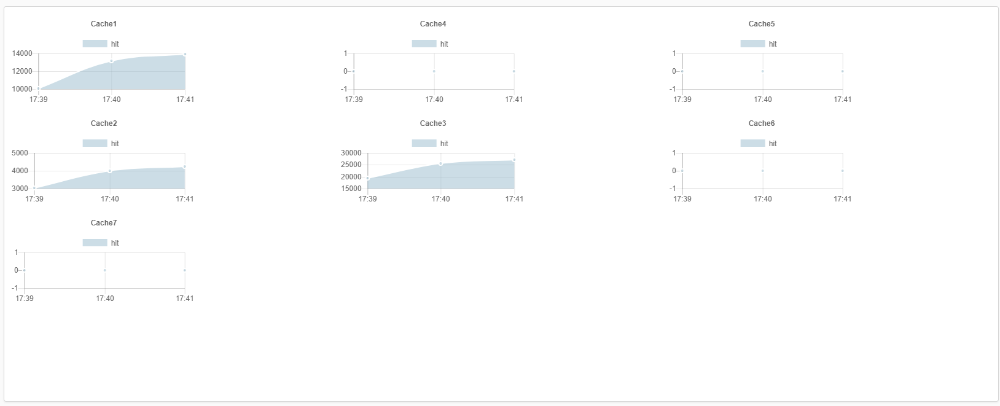
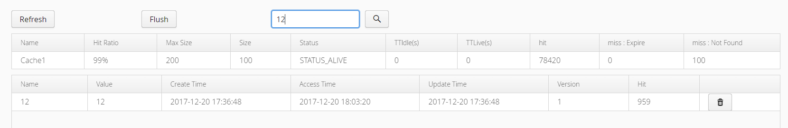

# spring-boot-ehcache-monitor

[  ](https://bintray.com/kingbbode/springboot/spring-boot-ehcache-monitor/_latestVersion)

## SPEC

- Spring Framework 4
- Eh Cache 3.x

## ENVIRONMENT

- JDK 1.8
- Spring Boot 

## Setup

### build.gradle

```
repositories {
    jcenter()
}

dependencies {
    compile 'com.github.kingbbode:spring-boot-ehcache-monitor:{version}'
}


dependencyManagement {
    imports {
        mavenBom "com.vaadin:vaadin-bom:8.1.0"
    }
}
```

## Usage

### Example



---

### Path

`your.application.com/admin/ehcache`

---

### DashBoard

#### EhCache LIST



- 전체 Cache 리스트와 기본 정보를 노출

#### Hit Line Chart



- 분 단위 Cache Hit Line Chart

---


#### Search 



- Cache 데이터의 Key 값 검색 지원

